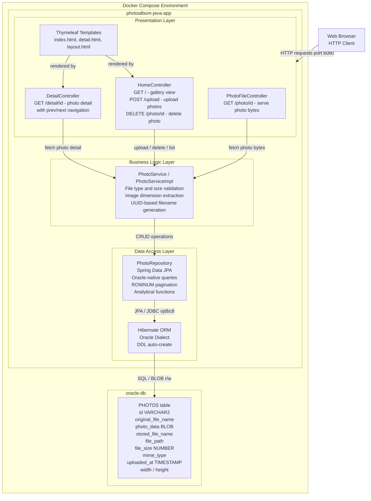

# Architecture Diagram

PhotoAlbum is a Spring Boot web application that stores photos as BLOBs in an Oracle Database and serves them via a Thymeleaf-based UI, deployed as a Docker container.

## Application Architecture

